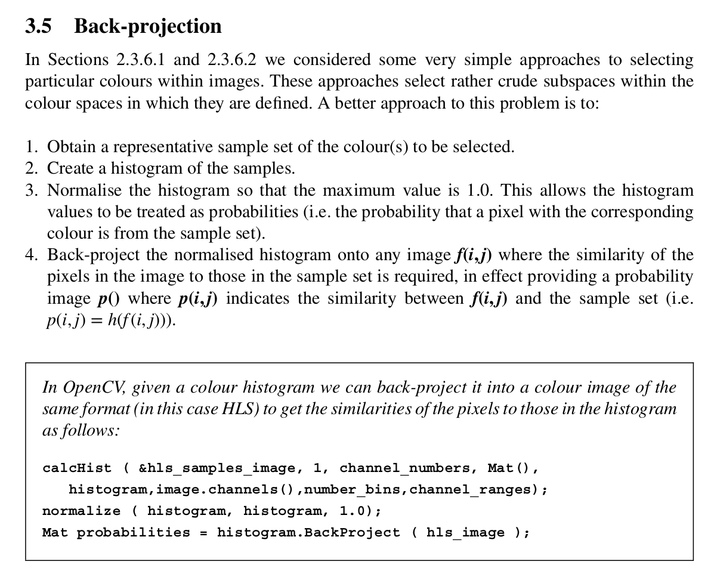
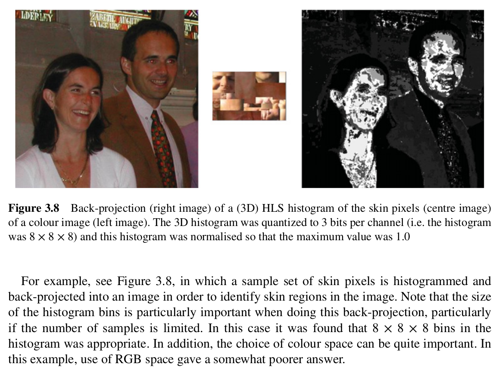

## Excerpts from His Book



---

### **Topics Mentioned**
- [Colour Thresholding](../../Computer%20Vision/Topics/Colour%20Thresholding.md)

### Code Example
```c++
calcHist ( &hls_samples_image, 1, channel_numbers, Mat(),
	histogram,image.channels(),number_bins,channel_ranges);
normalize ( histogram, histogram, 1.0);
Mat probabilities = histogram.BackProject ( hls_image );
```


### Explanation of Function
Essentially you create a histogram of the probability of a colour being your target. You then project that information onto an image and set a certain threshold above which a pixel is marked as your target colour. This is far better than regular colour thresholding, and Ken much prefers it.