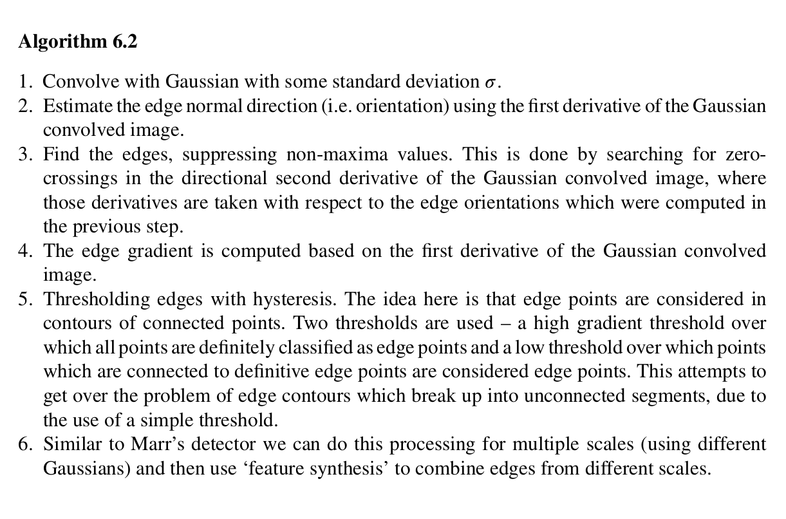

## Excerpts from His Book




---

### **Topics Mentioned**
- [First Derivative Edge Detection](../../Computer%20Vision/Topics/First%20Derivative%20Edge%20Detection.md)
- [Second Derivative Edge Detection](../../Computer%20Vision/Topics/Second%20Derivative%20Edge%20Detection.md)

The above topics are *essential* to understanding the following topic.

### Code Example
```c++
Canny(grey_image, binary_edges, 100, 200);
```
The Canny edge detection is a built in function in the standard OpenCV library.

### Explanation of Function
The Canny Edge detection algorithm combines both First Derivative Edge Detection (FDED) and Second Derivative Edge Detection (SDED). Initially Gaussian is applied to the image, then and FDED is applied, finding the edges. When this is done, non-maxima suppression is applied to find only the boldest edges. Then an SDED is applied to find the gradient of the edges (essentially seeing how strong they are and where they are at their weakest). Then those values are thresholded by two values. These two values are used to determine 1. The points on the image that are *definitely* edges, and 2. The points on the image that are probably edges based on their relationship to the points from 1. This is used so that any edges with weak-spots are still considered edges. After this, the image is compared using two different Gaussian filters of different scales to catch any significant changes.
