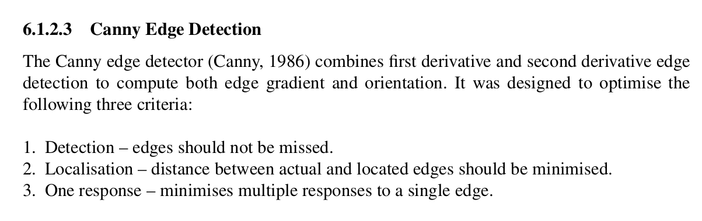
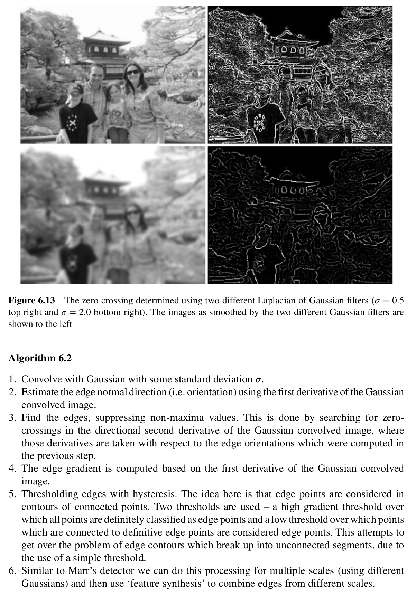
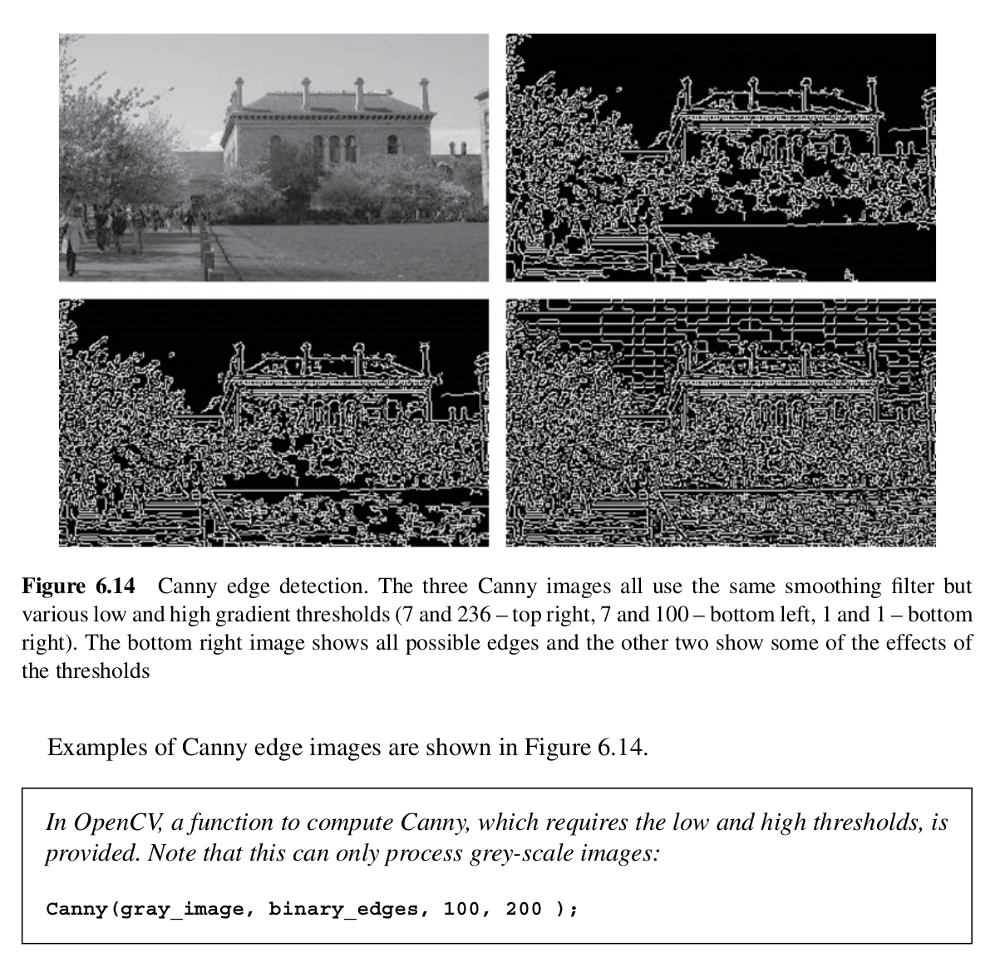

## Excerpts from His Book




---

### **Topics Mentioned**
- [First Derivative Edge Detection](../../Computer%20Vision/Topics/First%20Derivative%20Edge%20Detection.md)
- [Second Derivative Edge Detection](../../Computer%20Vision/Topics/Second%20Derivative%20Edge%20Detection.md)

### Code Example
```c++
boobies
```
bo

### Explanation of Function
obies