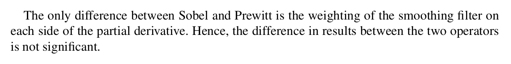

## Excerpts from His Book




---

### **Relevant Topics**
- [First Derivative Edge Detection](../../Computer%20Vision/Topics/First%20Derivative%20Edge%20Detection.md)
- [Roberts Edge Detector](../../Computer%20Vision/Topics/Roberts%20Edge%20Detector.md)

### Code Example
```c++
Mat horizontal_derivative, vertical_derivative;
Sobel( gray_image, horizontal_derivative, CV_32F ,1,0 );
Sobel( gray_image, vertical_derivative, CV_32F,0,1 );
```

### Explanation of Function
This function takes the changes in pixels on a vertical and horizontal axis (although more axis are possible, hence the compass name). These changes are represented in various shades of grey. They are then thresholded so that only changes of a certain significance are considered. This allows us to work on greyscale images, unlike Roberts Edge Detector. It's not as clean, but provides a good basis for further refinement. 

The only difference between the Sobel and Prewitt variants is the weighting of the smoothing filter. Due to this, we can essentially ignore this difference and treat them as the same.