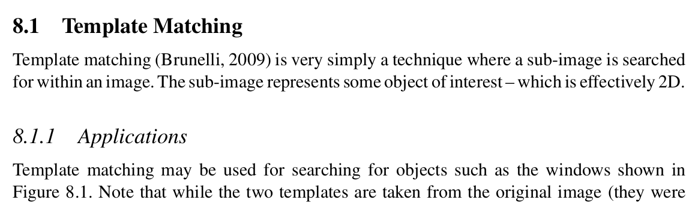
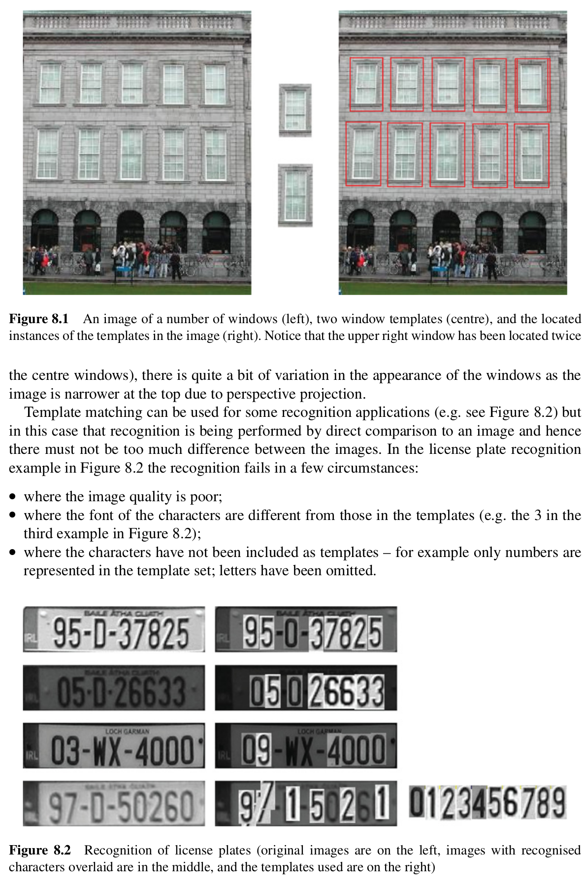
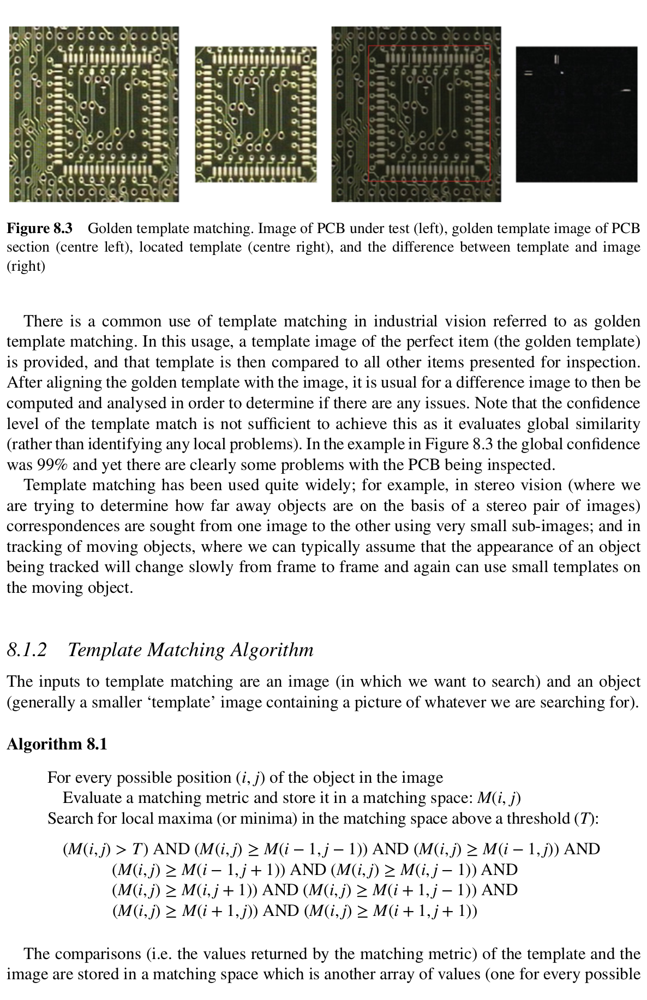
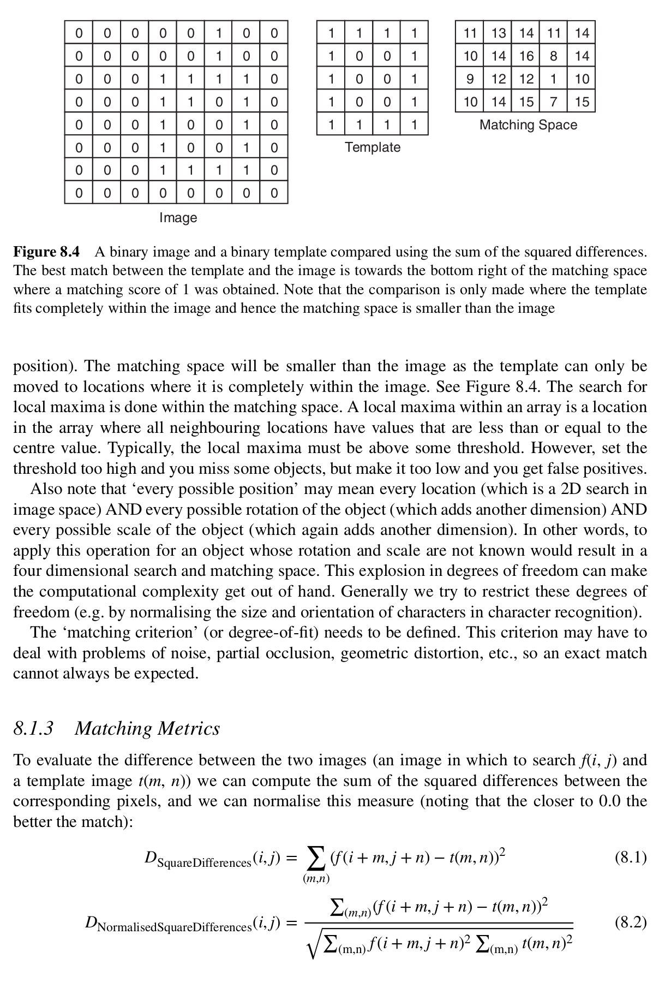
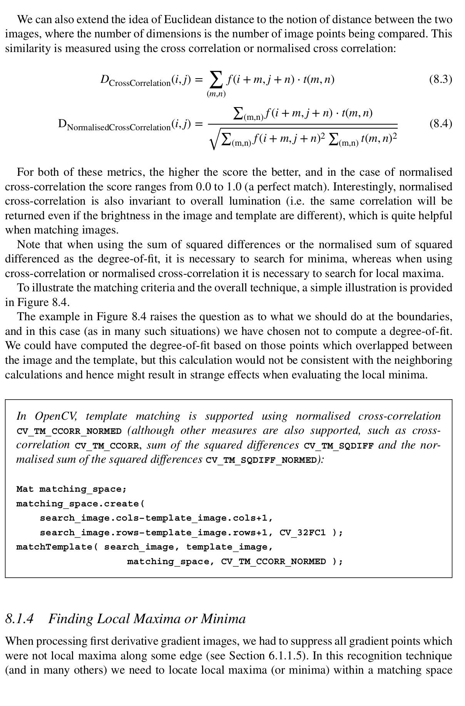
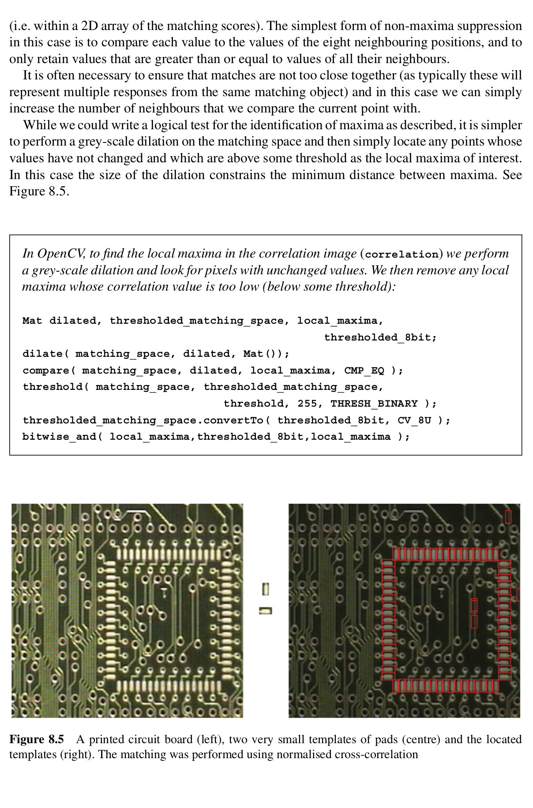
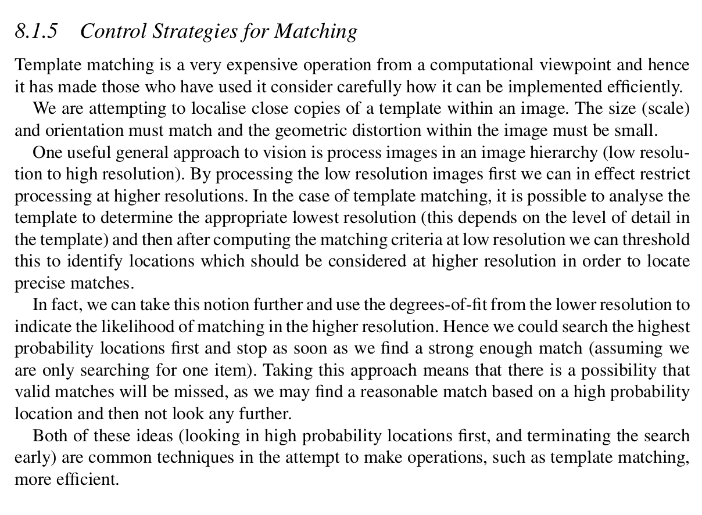
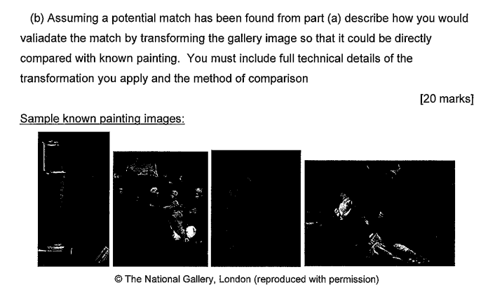

## Excerpts from His Book








### **Topics Mentioned**

### Code Example
```c++
Mat matching_space;
matching_space.create(
	search_image.cols–template_image.cols+1,
	search_image.rows–template_image.rows+1, CV_32FC1 );
matchTemplate( search_image, template_image,
				matching_space, CV_TM_CCORR_NORMED );
```
There is just a built in function to do template matching.

### Explanation of Function
This function is used when searching for a known target within an image. Reference images for what the target looks like are provided. The pixels of the target image are then compared to the pixels in an area of the image we are searching. After this, each pixel is converted to the sum of the squared differences. Therefore, the pixel with the lowest value is considered the most likely centre of the match.

There are a few issues with this approach. One of them being that it is highly sensitive to any geometrical deformations (such as a perspective warp). It is also highly susceptible to generating multiple positive matches in a small area. To avoid this, the area searched should be larger. 

The amin issue however is how costly this matching is. It requires a lot of computational power, especially on higher resolution images as it goes pixel by pixel. One of the proposed solution is to first scale the image down and try to find a likely match location within this lower resolution image. Then to search only in the area of the likely match in the higher resolution image. The issue is that this might cause us to lose out on some matches. 

### Sample Questions
2019 Exam Paper Question 3.b.
