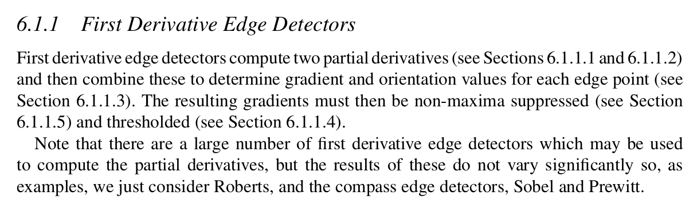

## Excerpts from His Book



---
### **Topics Mentioned**
- [Roberts Edge Detector](../../Computer%20Vision/Topics/Roberts%20Edge%20Detector.md)
- [Compass Edge Detectors](../../Computer%20Vision/Topics/Compass%20Edge%20Detectors.md)
- [Non-Maxima Compression](../../Computer%20Vision/Topics/Non-Maxima%20Compression.md)

The above topics are *essential* to understanding the following topic.

### Essential Key Words
- #### Partial Derivatives
	- Refer to calculating how pixel values change in the horizontal (X) and vertical (Y) directions within an image. They are essential for detecting edges and gradients, helping identify changes in brightness or colour intensity along different axes within the image.

### Code Example

```c++
// Applying Sobel operator for edge detection in the x-direction
    cv::Mat sobelX;
    cv::Sobel(grayImage, sobelX, CV_16S, 1, 0);

// Converting the result to an absolute value and converting back to 8-bit
    cv::Mat absSobelX;
    cv::convertScaleAbs(sobelX, absSobelX);
```


### Explanation of Function

First Derivative Edge Detection (FDED) is essentially an amalgam of multiple other functions. All of which are in the [Topics Mentioned](../../Computer%20Vision/Topics/First%20Derivative%20Edge%20Detection.md#topics-mentioned) section.

The two partial derivatives are Roberts Edge Detector (RED) and Compass Edge Detectors (CEDs) (Sobel and Prewitt). There are other partial derivatives but they all essentially result in the same thing and Ken will just be using those two. 

The method most widely used is the CEDs (both the Sobel and Prewitt variants are essentially the same) as opposed to Roberts Edge Detectors. This is due to the fact that CEDs work far better on greyscale images. RED really only works on binary images.

The result of a CED essentially gives the result of pixel gradient changes on two axes, separately. FDED essentially combines these two and creates a more comprehensive image of edges. It then has to further refine the image as the edges are likely to be too thick and ambiguous. 

To do this it applies thresholding to the images. This refines the edges to a certain degree, however, further refinement is required. To do this, non-maxima suppression is applied. This essentially looks at the pixels in a certain edge and only keeps the most prominent ones, and suppresses the less prominent ones.

This whole process results in a mostly clean image of edges.