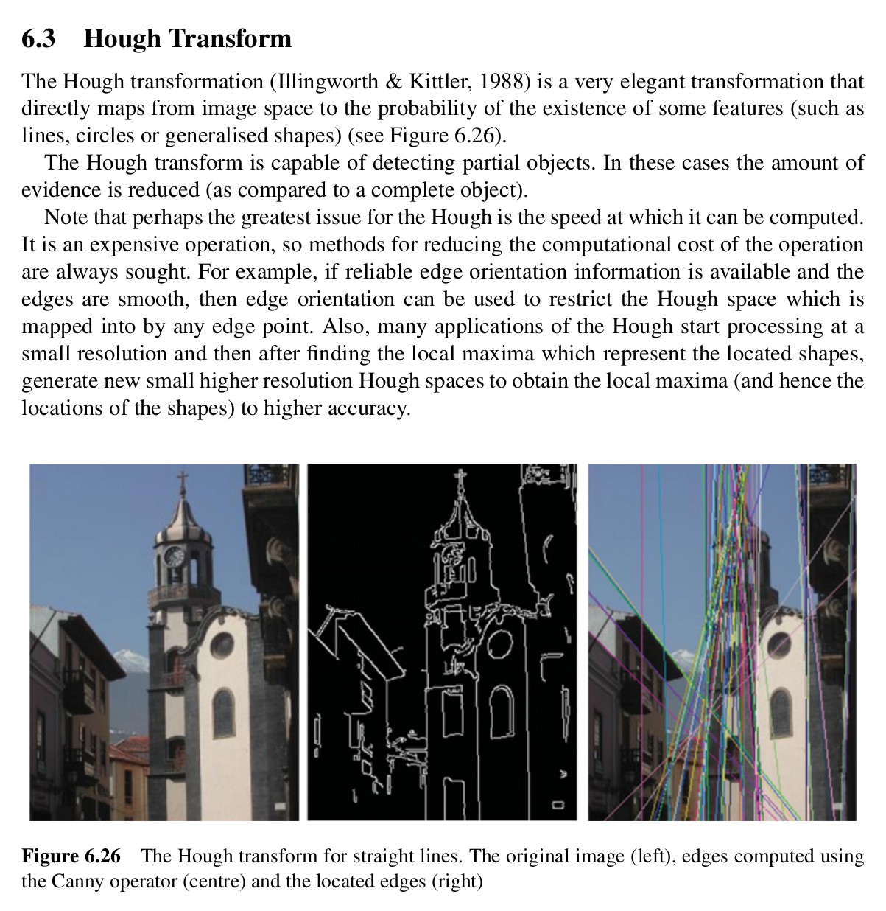
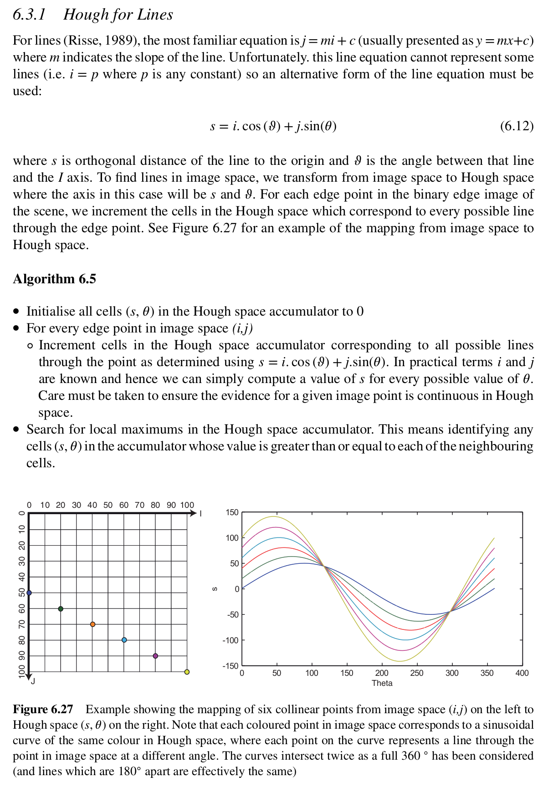
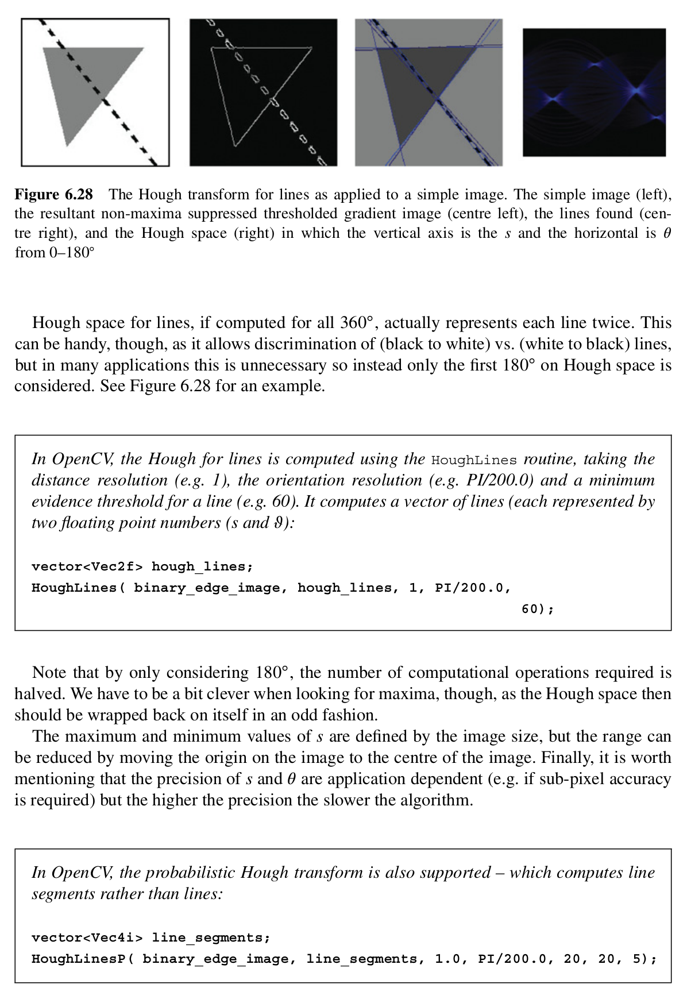
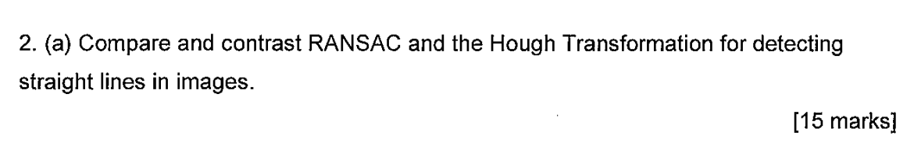

## Excerpts from His Book




---

### **Topics Mentioned**
- [Canny](../../Computer%20Vision/Topics/Canny.md)

### Code Example
```c++
vector<Vec2f> lines;
HoughLines(binary_edges_image, lines, 1, CV_PI / 180, 100);
```
Above is an example of using Hough Lines. It is a built in function from the OpenCV library. It results in a Vector of lines. It takes in an image that has been passed through the Canny detection algorithm.

### Explanation of Function
This function is very elegant, but quite resource and time intensive. It requires some preliminary edge detection (such as Canny edge detection). Once this edge detected binary image is supplied, it goes from pixel to pixel by each non-blank point on the image, it then essentially draws every possible like crossing through that point in all 360 degrees. It then checks for any lines that it has previously calculated to see if they match up with any of the lines it generated now. It then increments the counter for any lines that match up. At the end, it is left with an array which corresponds to all the possible lines in the image, all with values indicating how many pixels had a line of this type. After this, a thresholding value is used to determine true positives. This essentially means that if multiple cells had the same line pass through them, it is most likely a true line. Possible post-processing may include merging certain lines into one line.

It often detects a line twice as it checks in the full 360 degree space, meaning that a line rotated 180 degrees (essentially the same line) is also detected as a valid line. To stop this and to lessen the resource heaviness, it is very often advised to only check 180 degrees of the space to check for lines.

### Sample Questions
2019 Exam Paper Question 2.a.


### Comes up with these topics
- [RANSAC](../../Computer%20Vision/Topics/RANSAC.md)