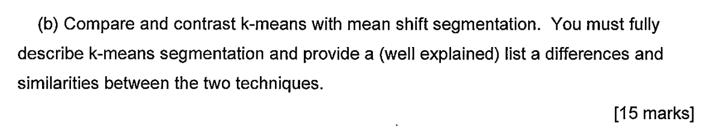

## Excerpts from His Book


---

### Code Example
```c++
// Store the image pixels as an array of samples
Mat samples(image.rows* image.cols, 3, CV_32F);
float* sample = samples.ptr<float>(0);
for(int row=0; row<image.rows; row++)
	for(int col=0; col<image.cols; col++)
		for (int channel=0; channel < 3; channel++)
			samples.at<float>(row* image.cols+col,channel) =
						(uchar) image.at<Vec3b>(row,col)[channel];
// Apply k-means clustering, determining the cluster
// centres and a label for each pixel.
Mat labels, centres;
kmeans (samples, k, labels, TermCriteria)
		CV_TERMCRIT_ITER|CV_TERMCRIT_EPS, 100, 0.0001),
		iterations, KMEANS_PP_CENTERS, centres );
// Use centres and label to populate the result image
Mat& result_image = Mat( image.size(), image.type() );
for(int row=0; row<image.rows; row++)
	for(int col=0; col<image.cols; col++)
		for (int channel=0; channel < 3; channel++)
			result_image.at<Vec3b>(row,col)[channel] = (uchar)
							centres.at<float>( * (labels.ptr<int>(
												row* image.cols+col )), channel);
```
In the code example above, the original image is converted to an array of samples. Essentially splitting the values into colour channels. After this, we apply the k-means clustering and determine the "closest match" to the current sample, taken from our predefined exemplars. These examplars then shift towards their cluster to remain in its center. After this, these exemplars are used to replace the original colour of each of the pixels. This results in an image with a more simplified colour space.

### Explanation of Function
What this function aims to do is simplify the amount of colours used in an image and group similar colours together into one colour. This makes processing the image much easier, but can result in a great loss of detail. 

First, the maximum limit of the amount of colours has to be chosen. There is no definite way to do this (just go off vibes). After this is done, The algorithm passes through each sample and labels them according to which exemplar they are closest to. This in turn shifts the exemplars to be in the center of gravity of its cluster. This can lead to a sample being relabelled if the exemplar shifts too far away from it. Once enough passes are completed, the algorithm is left with 1 <= n <= m exemplars, where n is the number of exemplars used in the output and m is the original limit set.

This is non-deterministic as the exemplars are chosen randomly and putting in the same limit rarely results in the same output. As such this function is not ideal.

### Sample Questions
2019 Exam Paper Question 1.b.


### Comes up with these topics
- [Mean Shift Segmentation](../../Computer%20Vision/Topics/Mean%20Shift%20Segmentation.md)