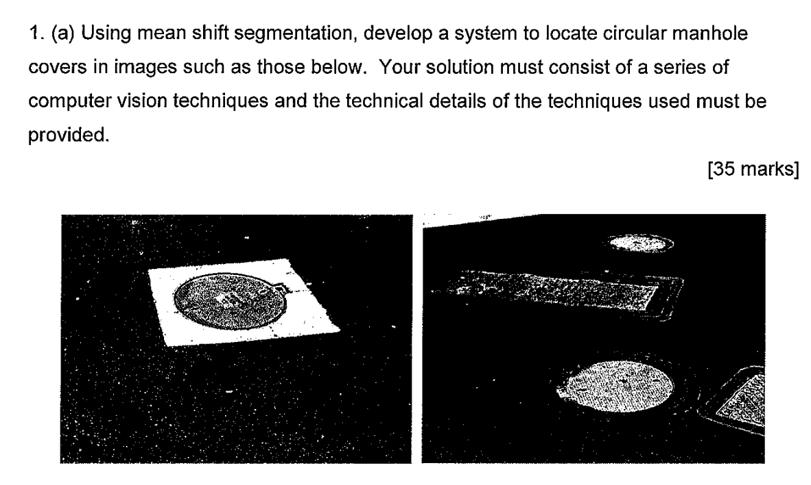

## Excerpts from His Book


---

### **Topics Mentioned**
- [Back Projection](../../Computer%20Vision/Topics/Back%20Projection.md)
- [Hill Climbing Algorithm](../../Computer%20Vision/Topics/Hill%20Climbing%20Algorithm.md)

### Code Example
```c++
Rect position(starting_position);
TermCriteria criteria(TermCriteria::MAX_ITER, 5, 0.01);
meanShift(back_projection_probabilities, position, criteria);
```

This essentially gives us the estimated starting position (the rectangle) and the back-projection probabilities (essentially how likely it is for a pixel to be part of the target). We use these two things to estimate more accurately the position of the target.

### Explanation of Function

The function is given a rough estimate of the starting location of the target in the form of a rectangle. Within this rectangle it then uses back-projection to essentially convert the pixels within the area to probabilistic values of how likely that pixel is to be a part of the target. Then, using the hill climbin algorithm, it finds the (most likely) local maxima.

This function tends to put a higher value on pixels towards the center of the target rather than the extremities. 


### Sample Questions
2019 Exam Paper Question 1.a.

2019 Exam Paper Question 1.b.


### Comes up with these topics
- [K-Means](../../Computer%20Vision/Topics/K-Means.md)