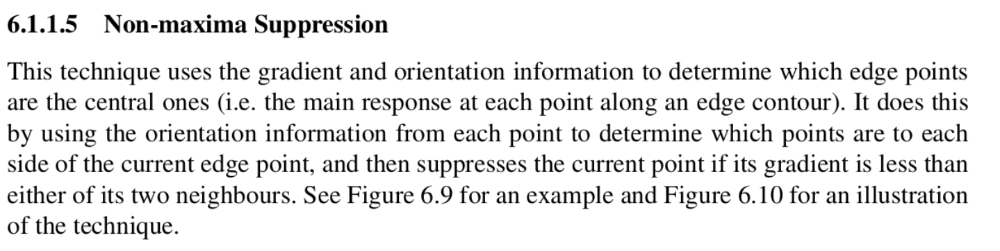
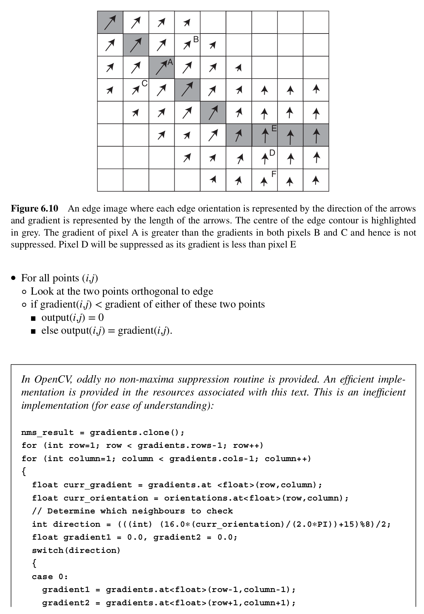
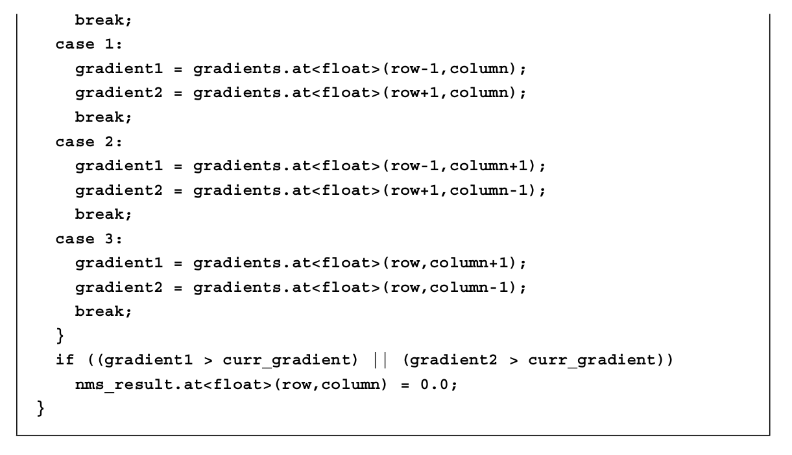

## Excerpts from His Book




---

### **Mentioned Topics**
- [First Derivative Edge Detection](../../Computer%20Vision/Topics/First%20Derivative%20Edge%20Detection.md)

### Code Example
```c++
void nonMaximumSuppression(std::vector<BoundingBox>& boxes, float threshold) {
    std::vector<BoundingBox> selectedBoxes;
    std::sort(boxes.begin(), boxes.end(), [](const BoundingBox& a, const BoundingBox& b) {
        return a.confidence > b.confidence;
    });

    for (const auto& box : boxes) {
        bool add = true;
        for (const auto& selectedBox : selectedBoxes) {
            if (calculateIntersectionOverUnion(box, selectedBox) > threshold) {
                add = false;
                break;
            }
        }
        if (add) {
            selectedBoxes.push_back(box);
        }
    }

    boxes = selectedBoxes;
}
```
Above is an example of non-maxima suppression. There is no default implementation provided in the OpenCV Library.

### Explanation of Function
This function checks the adjacent points for all points on a gradient and only retains those with the strongest values. This allows us to get rid of unnecessary pixels when detecting edges. 