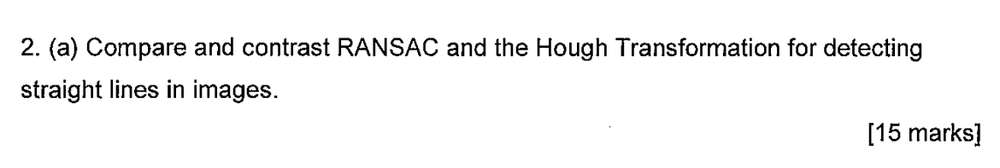

## Excerpts from His Slides (Not in the Book)


---

### Code Example
```c++
void fitLineRANSAC(const std::vector<cv::Point2f>& points, cv::Vec4f& line) {
    // Parameters for RANSAC
    const int iterations = 1000; // Number of RANSAC iterations
    const double distanceThreshold = 2.0; // Threshold to consider an inlier

    int maxInliers = 0;
    cv::RNG rng(cv::getTickCount());

    for (int i = 0; i < iterations; ++i) {
        // Randomly select two points
        int index1 = rng.uniform(0, points.size());
        int index2 = rng.uniform(0, points.size());

        cv::Point2f pt1 = points[index1];
        cv::Point2f pt2 = points[index2];

        // Fit a line using the two random points
        cv::Vec4f tempLine;
        cv::fitLine({ pt1, pt2 }, tempLine, cv::DIST_L2, 0, 0.01, 0.01);

        // Count inliers based on distance threshold
        int inliers = 0;
        for (const auto& pt : points) {
            float distance = std::abs(tempLine[0] * pt.x + tempLine[1] * pt.y + 
									  tempLine[2]) / std::sqrt(tempLine[0] * 
									  tempLine[0] + tempLine[1]	* tempLine[1]);
            if (distance < distanceThreshold)
                inliers++;
        }

        // Update the best line if this iteration produced more inliers
        if (inliers > maxInliers) {
            maxInliers = inliers;
            line = tempLine;
        }
    }
}
```
In the example above, it essentially picks thresholds and the maximum number of iterations before it fails. Then it randomly selects two points out of the list of points and fits a line between them. It then checks the amount of points that fit (somewhat) to that line. If it is above a certain threshold (set by you) it succeeds. If not, it randomly chooses two other points and tries again. 

### Explanation of Function
This function essentially randomly picks two points and draws a line between them. It then determines how many points lie within a certain threshold of this line. If it is above a certain number, it passes. If it is not above that threshold, it fails and restarts. It can fail a certain number of times before it aborts and fails altogehter. It can be good due to the possibility of being correct on the first try, but like with any randomised function, it can also fail many times without necessarily getting better between attempts. 

It is not really used due to its randomisation. Usually a better alternative is Hough Transformation.

---

### Sample Questions
2019 Exam Paper Question 2.a.


### Comes up with these topics
- [Hough Transformation - Lines](../../Computer%20Vision/Topics/Hough%20Transformation%20-%20Lines.md)