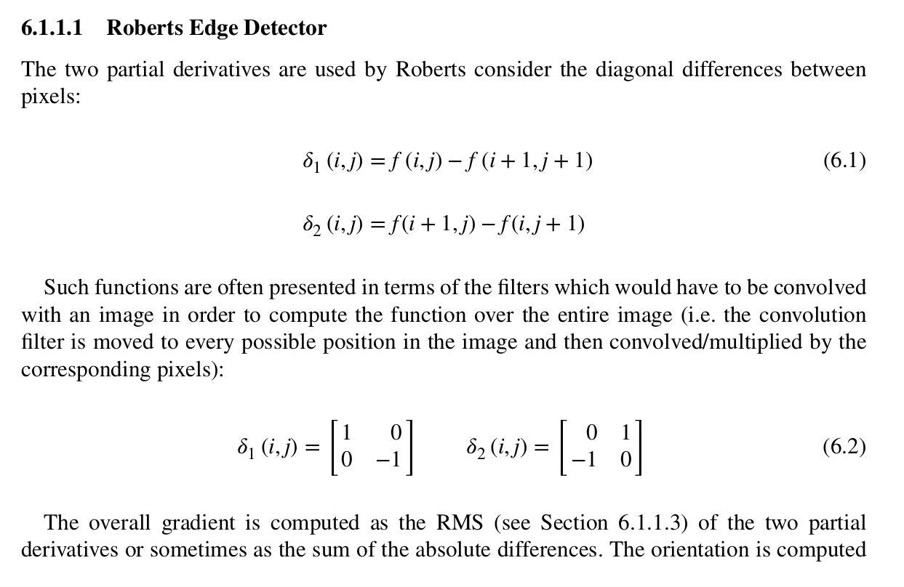
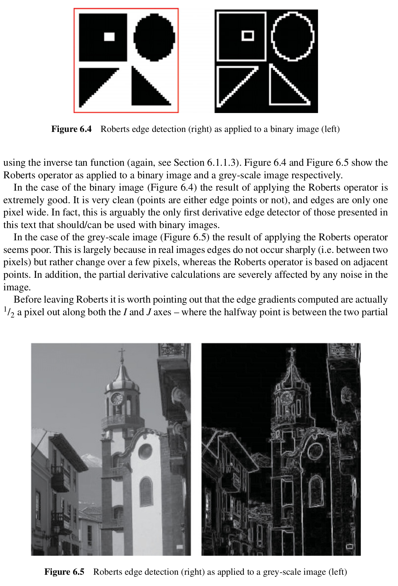
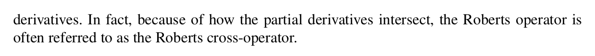

## Excerpts from His Book

---

### **Relevant Topics**
- [First Derivative Edge Detection](../../Computer%20Vision/Topics/First%20Derivative%20Edge%20Detection.md)
- [Compass Edge Detectors](../../Computer%20Vision/Topics/Compass%20Edge%20Detectors.md)

### Explanation of Function
This partial derivative is ideal only in binary images. It works best when edges are only 1 pixel wide as it compares points on an adjacent basis. It detects edges perfectly on a binary image but is not very useful in gradient situations. 

It also calculates the edges as 1/2 a pixel out from the actual edges. 
