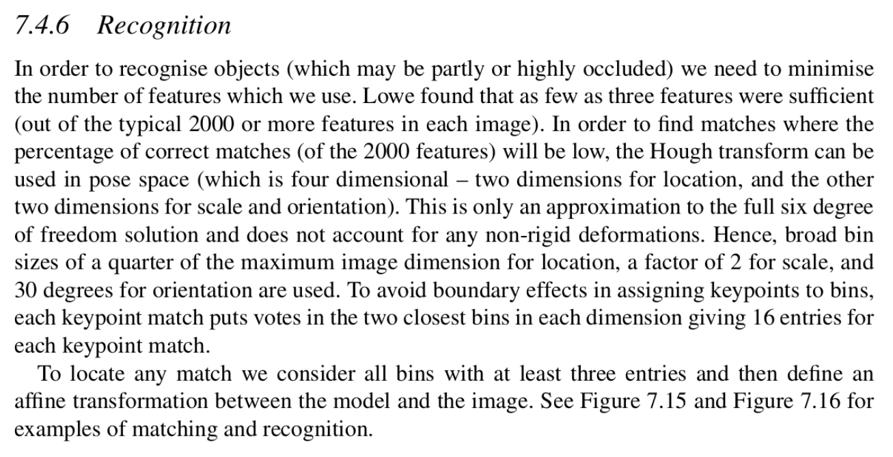
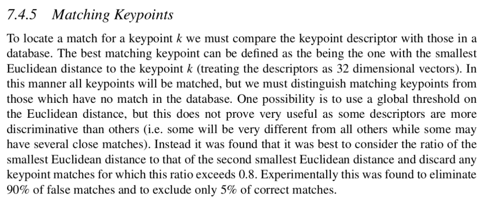
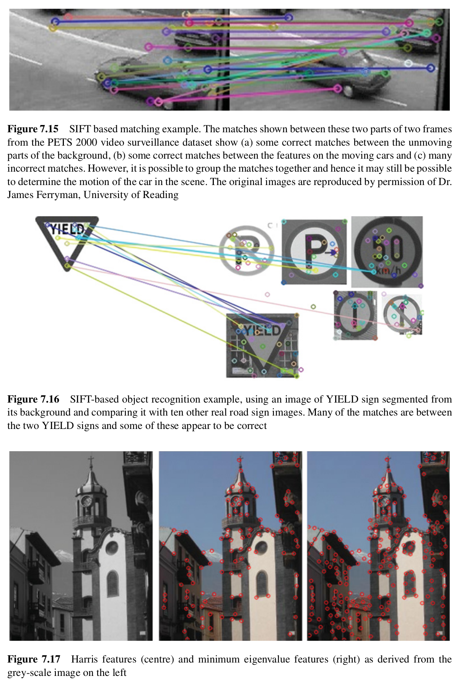

## Excerpts from His Book




### **Topics Mentioned**
- [SIFT](../../Computer%20Vision/Topics/SIFT.md)

### Code Example
```c++
// Match descriptors between the two images using a Brute-Force matcher
    cv::Ptr<cv::DescriptorMatcher> matcher =
		  cv::DescriptorMatcher::create(cv::DescriptorMatcher::BRUTEFORCE);
    std::vector<cv::DMatch> matches;
    matcher->match(descriptors1, descriptors2, matches);
```

### Function Explanation
The matching of keypoints between your image and the keypoints inside the matching database is a single function. It uses Euclidian values to measure the distance between the keypoint and the best matching keypoint in the matching database. The current best method to do this is to consider the ratio of the smallest Euclidian distance to the second smallest, and discard any keypoint matches for which this ratio exceeds 0.8. This yields great results of eliminating 90% false matches and only deleting 5% of true positives.