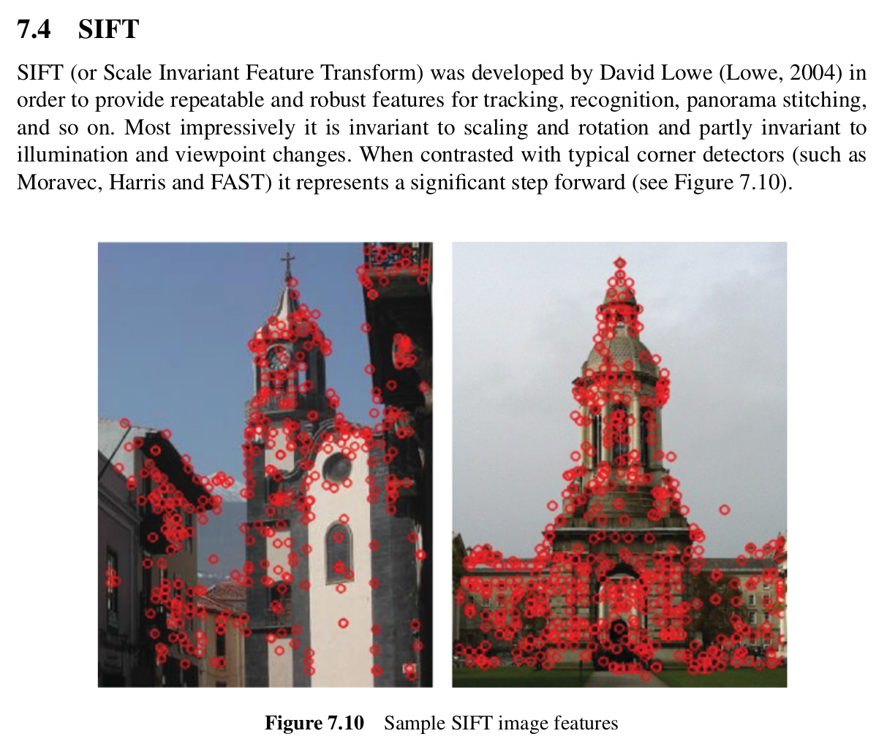
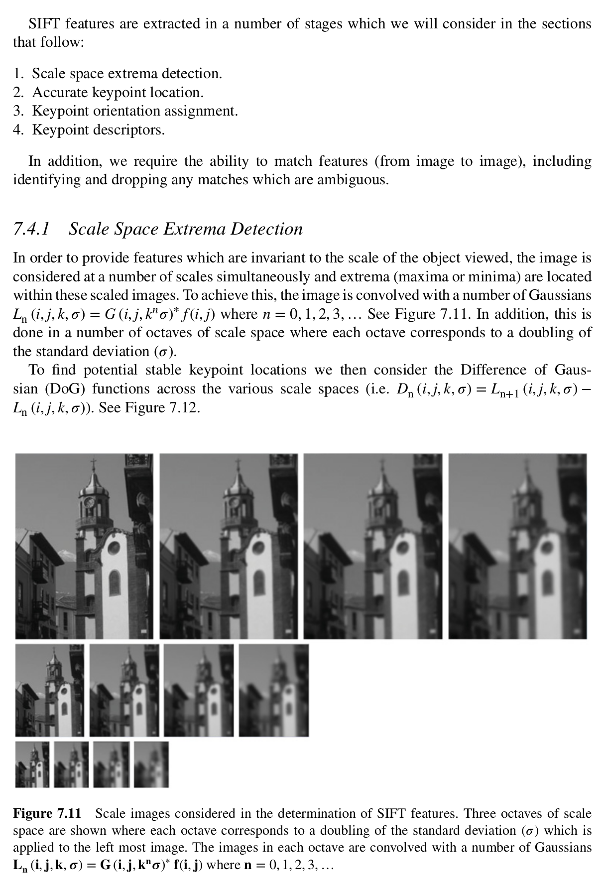
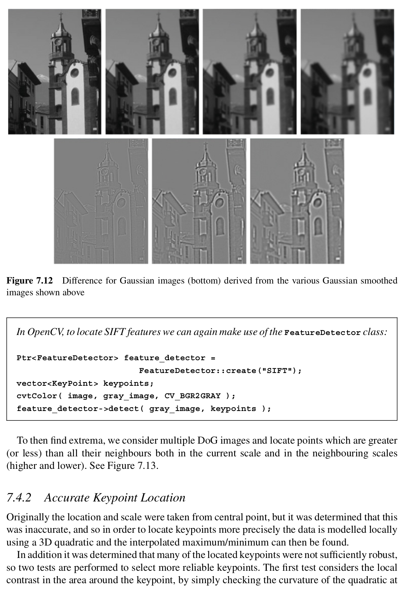
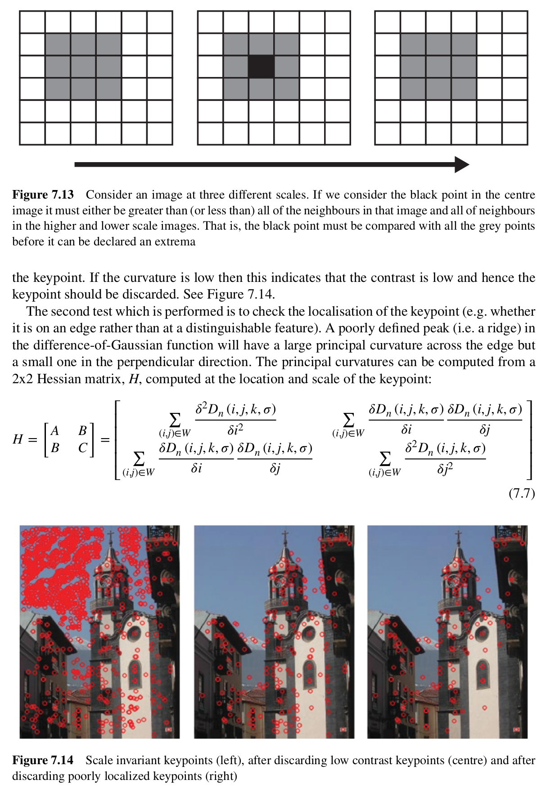
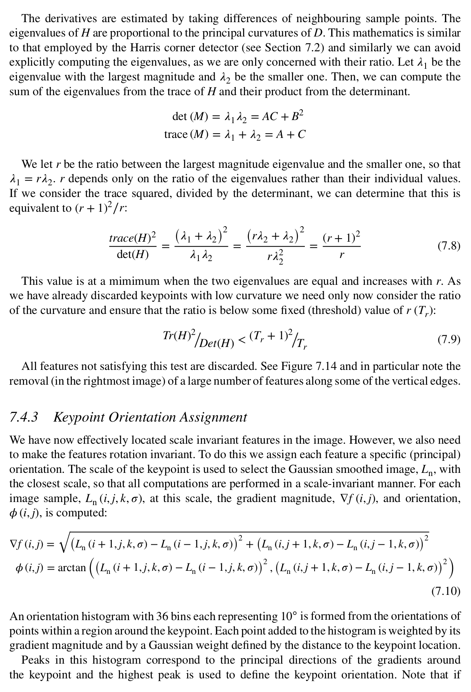
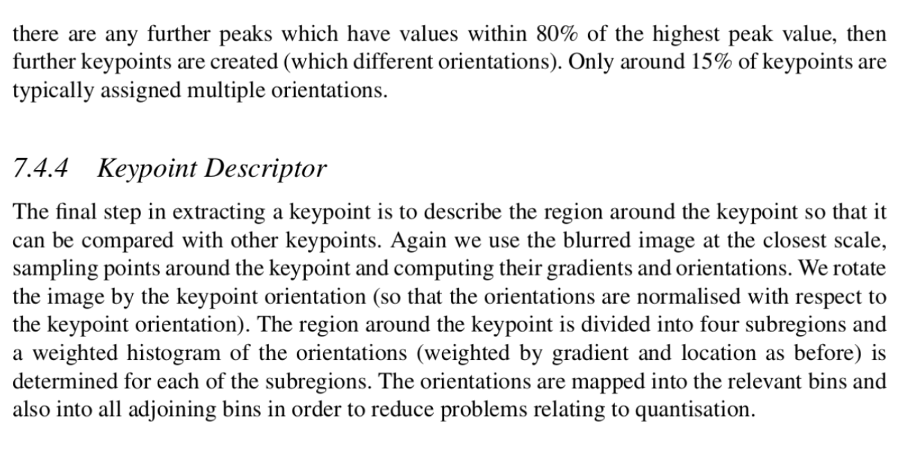
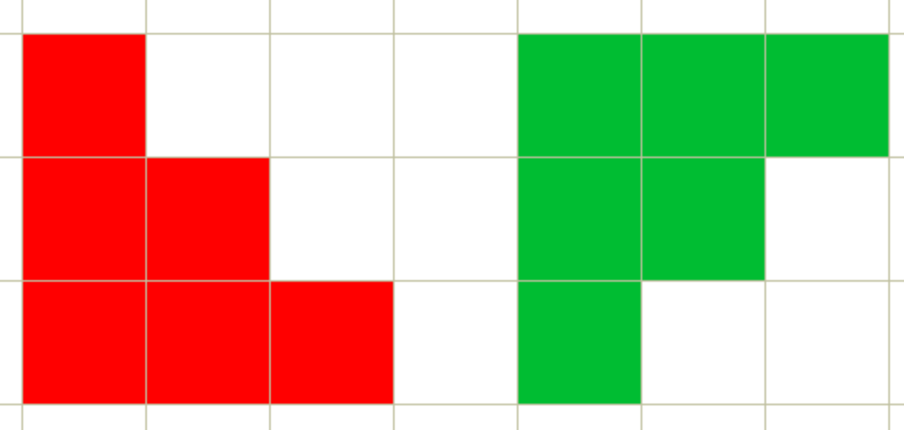
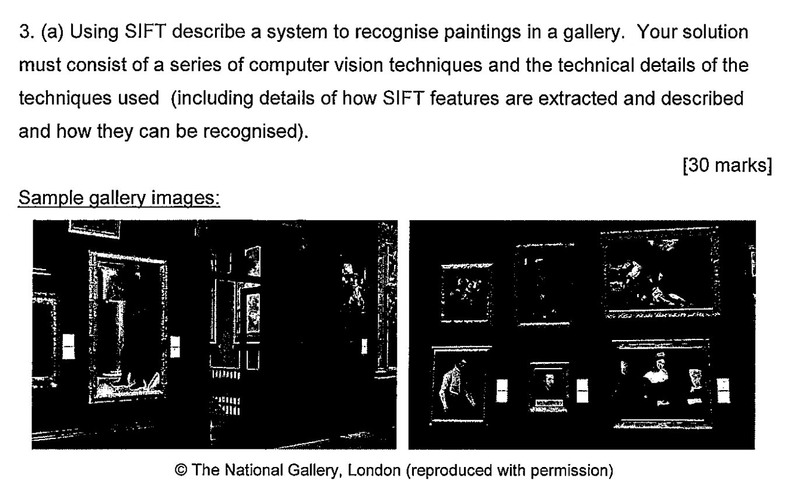

## Excerpts from His Book







### **Topics Mentioned**
- [FAST](../../Computer%20Vision/Topics/FAST.md)
- [Harris Corner Detection](../../Computer%20Vision/Topics/Harris%20Corner%20Detection.md)
- [Gaussian](../../Computer%20Vision/Topics/Gaussian.md)

### **Relevant Topics**
- [SIFT Recognition](../../Computer%20Vision/Topics/SIFT%20Recognition.md)

### Code Example
```c++
// Convert the image to grayscale
    cv::Mat grayImage;
    cv::cvtColor(image, grayImage, cv::COLOR_BGR2GRAY);

// Create SIFT detector
    cv::Ptr<cv::FeatureDetector> sift = cv::FeatureDetector::create("SIFT");

// Detect keypoints and compute descriptors
    std::vector<cv::KeyPoint> keypoints;
    cv::Mat descriptors;
    sift->detectAndCompute(grayImage, cv::noArray(), keypoints, descriptors);

```

### Explanation of Function
This is a function which essentially extracts important and distinctive keypoints within an image. The important part is that it does so with essentially no regard to the size of the image, the rotation of the image (and to a certain degree the rotation of the object in the image), and with only partial regard to lighting conditions. There is a LOT of maths involved in this, but we do not have to know the exact maths behind this function. The function can be broken down into a few steps.

Initially, the image is scaled and blurred (Gaussian) to multiple degrees. This is to account for scale in the image. We then locate all the keypoints within these images.

When this is done, we compare all of these keypoints to make sure our locations are accurate. This is done by comparing the maxima of each of the points, discarding points with low contrast. This is used to only keep keypoints consistent regardless of scale.

After this, we are left with pretty accurate keypoints, however we then have to assign the orientation of the keypoints. The maths behind this is kind of complicated but it is essentially used so that the same keypoint can be recognised regardless of which way the picture is rotated. See the below example.

The red and green shapes are the same shape, simply rotated 90 degrees.

The last step are Keypoint Descriptors. These are basically numerical representations of various data of the neighbouring areas (colour, texture, intensity gradients) of a keypoint. This gives a keypoint a wider context and helps in recognising a keypoint, regardless of scale, lighting, or rotation. 

After these steps, we have data on the keypoints in an image. We need to corss reference this with various samples of known correct matches. This is discussed in [SIFT Recognition](../../Computer%20Vision/Topics/SIFT%20Recognition.md).

---

### Sample Questions
2019 Exam Paper Question 3.a.

