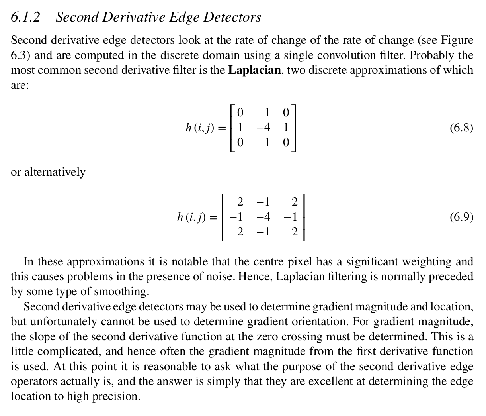
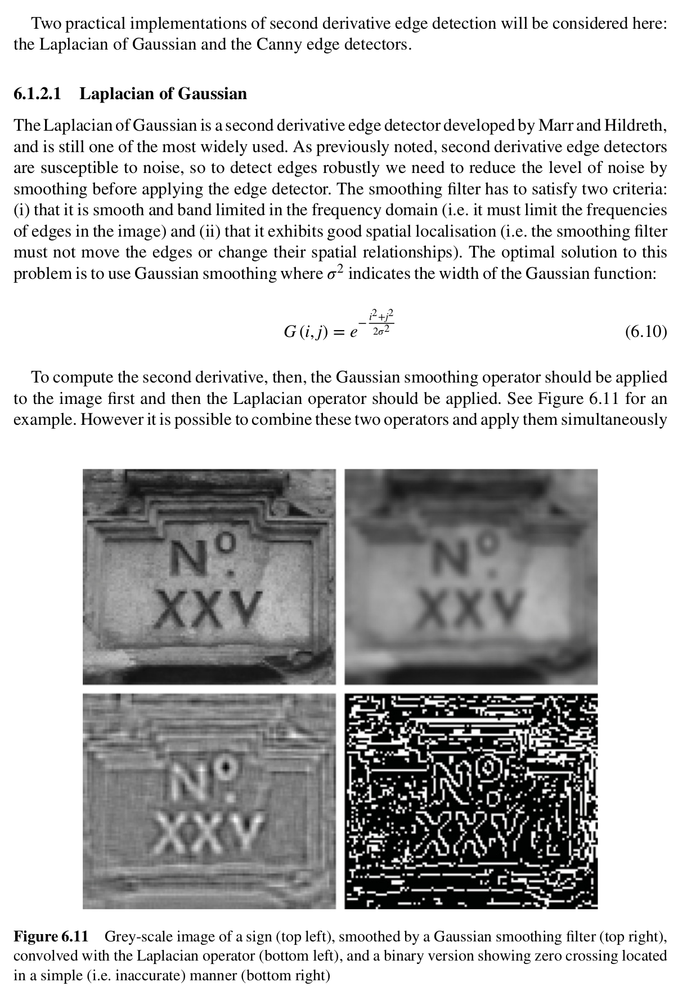
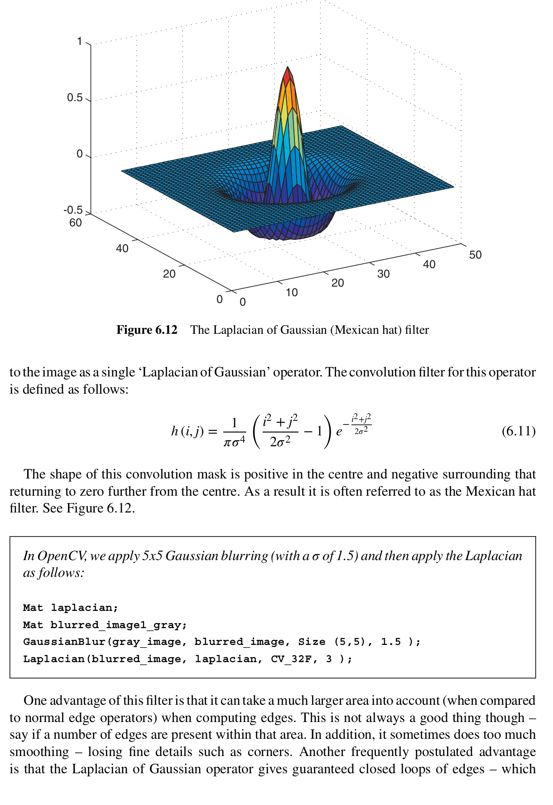
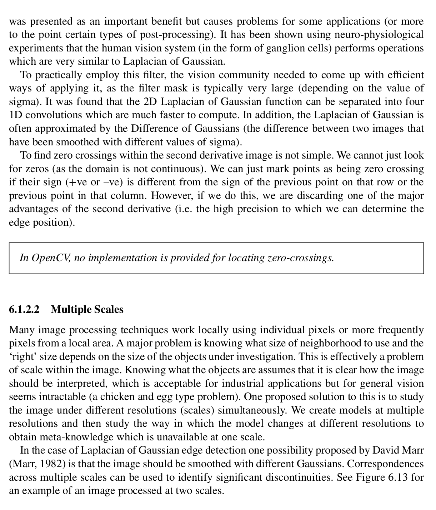
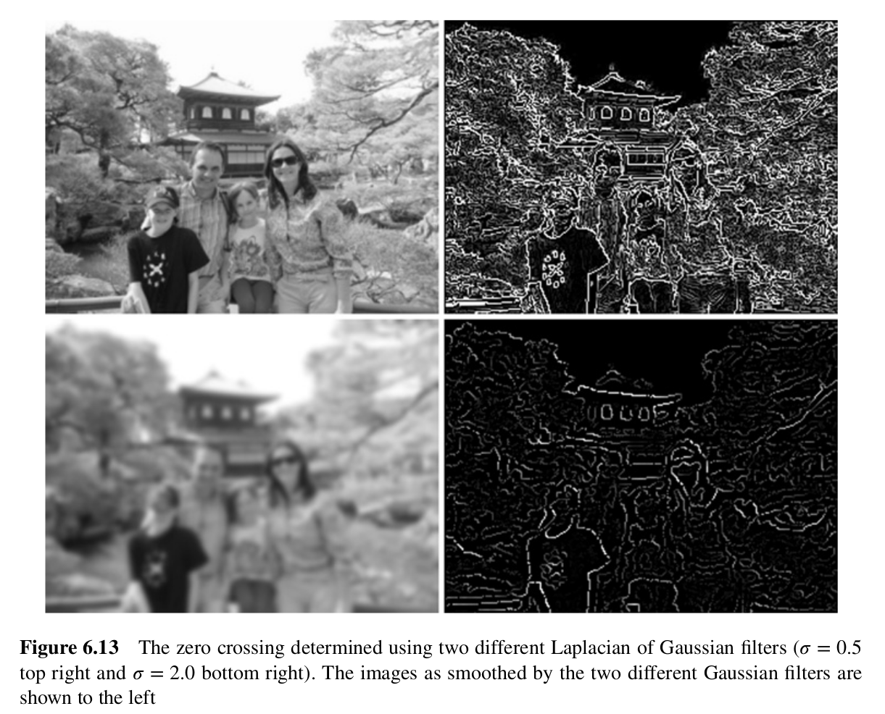

## Excerpts from His Book






### **Topics Mentioned**
- [Canny](../../Computer%20Vision/Topics/Canny.md)
- [First Derivative Edge Detection](../../Computer%20Vision/Topics/First%20Derivative%20Edge%20Detection.md)
- [Gaussian](../../Computer%20Vision/Topics/Gaussian.md)

### Code Example
```c++
Mat laplacian, blurred_image;
GaussianBlur(gray_image, blurred_image, Size (5,5), 1.5 );
Laplacian(blurred_image, laplacian, CV_32F, 3 );
```

### Explanation of Function
Unlike the First Derivative Edge Detectors, the Second Derivative Edge Detectors (SDED) measures the rate of change of the rate of change of the pixels in an image. Essentially seeing how dramatic the change is, indicating a strong edge. The issue with these is that the center pixel in the 3x3 matrix used for analysis is weighted very heavily. This can cause issues if the image is noisy. To negate this, the image has to be smoothed before a SDED is applied. The optimal smoothing soution to this is the Gaussian Smoothing as it limits the frequencies of edges in the image, but it does not tend to erase any important details such as corners. 

The most common SDED is the Laplacian operator. When applied in conjunction with the Gaussian Smoothing, it yields very precise results.

An issue with SDEDs is the issue of scale. Essentially it is quite hard to figure out what matrix size to use when analysing an image because without knowing in advance the size of your target, the wrong size is likely to miss some details. The issue is mostly solved by the multiple scales solution. This is where two Gaussian Smoothing effects of different sizes are applied to the same image and the two results are cross examined. When the Laplacian of Gaussian (the common name for the operator as it is essential to use Gaussian Smoothing for it to work) is then applied, t is possible to spot any significant discontinuities.